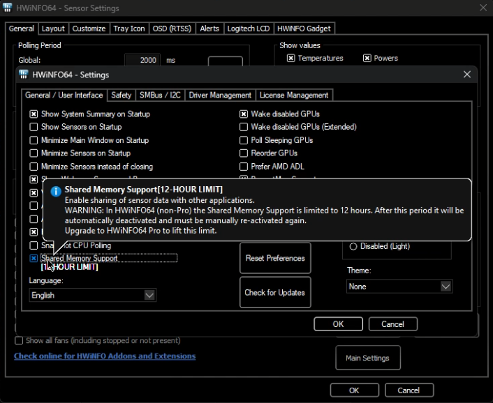

#  Clean Meter

> Did you like my work? Consider supporting me so I can keep putting hours in.
> https://ko-fi.com/danil0v3s

> [!IMPORTANT]  
> We released 0.0.4 which DROPPED the need of MSI Afterburner and rely entirely on HWInfo alone. We heard some of you dislike Afterburner so we opted to go the least friction route.

## What is this?

A small desktop companion app to display sleek graphs overlays from HWInfo. Designs were made by [/u/Violetmars](https://www.reddit.com/user/Violetmars/)

## Getting started
1. Make sure you have HWInfo up and running and RTSS overlay turned off
2. Enable Shared Memory Support in HWInfo

3. Download the latest release, run it

## Current Limitations
- Doesn't work with exclusive fullscreen

## More Images

